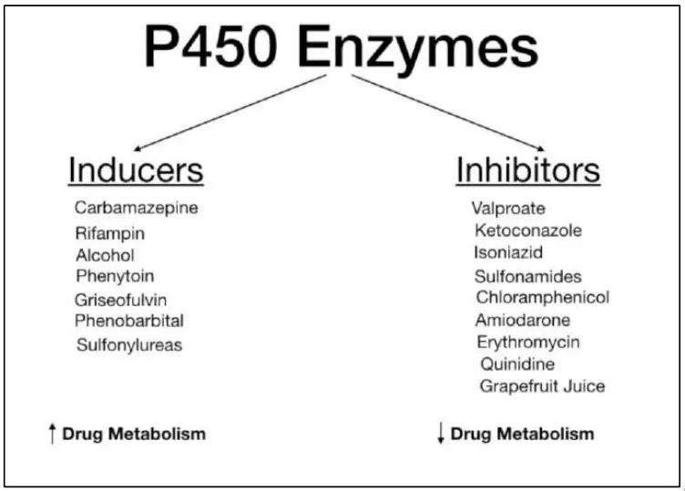

# [P450 Enzyme System](https://en.wikipedia.org/wiki/Cytochrome_P450)

### CYP families in humans

Humans have 57 genes and more than 59
[pseudogenes](https://en.wikipedia.org/wiki/pseudogene) divided among 18 families of
cytochrome P450 genes and 43 subfamilies. This is a summary of the
genes and of the proteins they encode. See the homepage of the
cytochrome P450 Nomenclature Committee for detailed information.

|            |                                                                                                                                                                                                                                                                                                                             |                                                                                      |                                                                                                                                                                                                                                                                                                                                                                                                                                                                                                                                                                                                                                                                                                                                                                                                      |                                                    |
|------------|-----------------------------------------------------------------------------------------------------------------------------------------------------------------------------------------------------------------------------------------------------------------------------------------------------------------------------|--------------------------------------------------------------------------------------|------------------------------------------------------------------------------------------------------------------------------------------------------------------------------------------------------------------------------------------------------------------------------------------------------------------------------------------------------------------------------------------------------------------------------------------------------------------------------------------------------------------------------------------------------------------------------------------------------------------------------------------------------------------------------------------------------------------------------------------------------------------------------------------------------|----------------------------------------------------|
| **Family** | **Function**                                                                                                                                                                                                                                                                                                                | **Members**                                                                          | **Genes**                                                                                                                                                                                                                                                                                                                                                                                                                                                                                                                                                                                                                                                                                                                                                                                            | **pseudogenes**                                    |
| **CYP1**   | drug and steroid (especially [estrogen](https://en.wikipedia.org/wiki/estrogen)) metabolism, [benzo(a)pyrene](https://en.wikipedia.org/wiki/Benzo\(a\)pyrene) toxification (forming [(+)-Benzo(a)pyrene-7,8-dihydrodiol-9,10-epoxide](https://en.wikipedia.org/wiki/\(%2B\)-Benzo\(a\)pyrene-7,8-dihydrodiol-9,10-epoxide)) | 3 subfamilies, 3 genes, 1 [pseudogene](https://en.wikipedia.org/wiki/pseudogene)     | [CYP1A1](https://en.wikipedia.org/wiki/CYP1A1), [CYP1A2](https://en.wikipedia.org/wiki/CYP1A2), [CYP1B1](https://en.wikipedia.org/wiki/CYP1B1)                                                                                                                                                                                                                                                                                                                                                                                                                                                                                                                                                                                                                                                       | [CYP1D1P](https://en.wikipedia.org/wiki/CYP1D1P)   |
| **CYP2**   | drug and [steroid](https://en.wikipedia.org/wiki/steroid) metabolism                                                                                                                                                                                                                                                        | 13 subfamilies, 16 genes, 16 [pseudogenes](https://en.wikipedia.org/wiki/pseudogene) | [CYP2A6](https://en.wikipedia.org/wiki/CYP2A6), [CYP2A7](https://en.wikipedia.org/wiki/CYP2A7), [CYP2A13](https://en.wikipedia.org/wiki/CYP2A13), [CYP2B6](https://en.wikipedia.org/wiki/CYP2B6), [CYP2C8](https://en.wikipedia.org/wiki/CYP2C8), [CYP2C9](https://en.wikipedia.org/wiki/CYP2C9), [CYP2C18](https://en.wikipedia.org/wiki/CYP2C18), [CYP2C19](https://en.wikipedia.org/wiki/CYP2C19), [CYP2D6](https://en.wikipedia.org/wiki/CYP2D6), [CYP2E1](https://en.wikipedia.org/wiki/CYP2E1), [CYP2F1](https://en.wikipedia.org/wiki/CYP2F1), [CYP2J2](https://en.wikipedia.org/wiki/CYP2J2), [CYP2R1](https://en.wikipedia.org/wiki/CYP2R1), [CYP2S1](https://en.wikipedia.org/wiki/CYP2S1), [CYP2U1](https://en.wikipedia.org/wiki/CYP2U1), [CYP2W1](https://en.wikipedia.org/wiki/CYP2W1) | Too many to list                                   |
| **CYP3**   | drug and [steroid](https://en.wikipedia.org/wiki/steroid) (including [testosterone](https://en.wikipedia.org/wiki/testosterone)) metabolism                                                                                                                                                                                 | 1 subfamily, 4 genes, 4 [pseudogenes](https://en.wikipedia.org/wiki/pseudogene)      | [CYP3A4](https://en.wikipedia.org/wiki/CYP3A4), [CYP3A5](https://en.wikipedia.org/wiki/CYP3A5), [CYP3A7](https://en.wikipedia.org/wiki/CYP3A7), [CYP3A43](https://en.wikipedia.org/wiki/CYP3A43)                                                                                                                                                                                                                                                                                                                                                                                                                                                                                                                                                                                                     | CYP3A51P, CYP3A52P, CYP3A54P, CYP3A137P            |
| **CYP4**   | [arachidonic acid](https://en.wikipedia.org/wiki/arachidonic_acid) or fatty acid metabolism                                                                                                                                                                                                                                 | 6 subfamilies, 12 genes, 10 [pseudogenes](https://en.wikipedia.org/wiki/pseudogene)  | [CYP4A11](https://en.wikipedia.org/wiki/CYP4A11), [CYP4A22](https://en.wikipedia.org/wiki/CYP4A22), [CYP4B1](https://en.wikipedia.org/wiki/CYP4B1), [CYP4F2](https://en.wikipedia.org/wiki/CYP4F2), [CYP4F3](https://en.wikipedia.org/wiki/CYP4F3), [CYP4F8](https://en.wikipedia.org/wiki/CYP4F8), [CYP4F11](https://en.wikipedia.org/wiki/CYP4F11), [CYP4F12](https://en.wikipedia.org/wiki/CYP4F12), [CYP4F22](https://en.wikipedia.org/wiki/CYP4F22), [CYP4V2](https://en.wikipedia.org/wiki/CYP4V2), [CYP4X1](https://en.wikipedia.org/wiki/CYP4X1), [CYP4Z1](https://en.wikipedia.org/wiki/CYP4Z1)                                                                                                                                                                                             | Too many to list                                   |
| **CYP5**   | [thromboxane](https://en.wikipedia.org/wiki/thromboxane) A2 [synthase](https://en.wikipedia.org/wiki/thromboxane-A_synthase)                                                                                                                                                                                     | 1 subfamily, 1 gene                                                                  | [CYP5A1](https://en.wikipedia.org/wiki/Thromboxane-A_synthase)                                                                                                                                                                                                                                                                                                                                                                                                                                                                                                                                                                                                                                                                                                                                       |                                                    |
| **CYP7**   | [bile acid](https://en.wikipedia.org/wiki/bile_acid) biosynthesis 7-alpha hydroxylase of steroid nucleus                                                                                                                                                                                                                    | 2 subfamilies, 2 genes                                                               | [CYP7A1](https://en.wikipedia.org/wiki/CYP7A1), [CYP7B1](https://en.wikipedia.org/wiki/CYP7B1)                                                                                                                                                                                                                                                                                                                                                                                                                                                                                                                                                                                                                                                                                                       |                                                    |
| **CYP8**   | *varied*                                                                                                                                                                                                                                                                                                                    | 2 subfamilies, 2 genes                                                               | [CYP8A1](https://en.wikipedia.org/wiki/CYP8A1) ([prostacyclin](https://en.wikipedia.org/wiki/prostacyclin) synthase), [CYP8B1](https://en.wikipedia.org/wiki/CYP8B1) (bile acid biosynthesis)                                                                                                                                                                                                                                                                                                                                                                                                                                                                                                                                                                                                        |                                                    |
| **CYP11**  | [steroid](https://en.wikipedia.org/wiki/steroid) biosynthesis                                                                                                                                                                                                                                                               | 2 subfamilies, 3 genes                                                               | [CYP11A1](https://en.wikipedia.org/wiki/CYP11A1), [CYP11B1](https://en.wikipedia.org/wiki/CYP11B1), [CYP11B2](https://en.wikipedia.org/wiki/CYP11B2)                                                                                                                                                                                                                                                                                                                                                                                                                                                                                                                                                                                                                                                 |                                                    |
| **CYP17**  | [steroid](https://en.wikipedia.org/wiki/steroid) biosynthesis, 17-alpha hydroxylase                                                                                                                                                                                                                                         | 1 subfamily, 1 gene                                                                  | [CYP17A1](https://en.wikipedia.org/wiki/CYP17A1)                                                                                                                                                                                                                                                                                                                                                                                                                                                                                                                                                                                                                                                                                                                                                     |                                                    |
| **CYP19**  | [steroid](https://en.wikipedia.org/wiki/steroid) biosynthesis: [aromatase](https://en.wikipedia.org/wiki/aromatase) synthesizes [estrogen](https://en.wikipedia.org/wiki/estrogen)                                                                                                                                          | 1 subfamily, 1 gene                                                                  | [CYP19A1](https://en.wikipedia.org/wiki/CYP19A1)                                                                                                                                                                                                                                                                                                                                                                                                                                                                                                                                                                                                                                                                                                                                                     |                                                    |
| **CYP20**  | unknown function                                                                                                                                                                                                                                                                                                            | 1 subfamily, 1 gene                                                                  | [CYP20A1](https://en.wikipedia.org/wiki/CYP20A1)                                                                                                                                                                                                                                                                                                                                                                                                                                                                                                                                                                                                                                                                                                                                                     |                                                    |
| **CYP21**  | [steroid](https://en.wikipedia.org/wiki/steroid) biosynthesis                                                                                                                                                                                                                                                               | 1 subfamilies, 1 gene, 1 pseudogene                                                  | [CYP21A2](https://en.wikipedia.org/wiki/CYP21A2)                                                                                                                                                                                                                                                                                                                                                                                                                                                                                                                                                                                                                                                                                                                                                     | [CYP21A1P](https://en.wikipedia.org/wiki/CYP21A1P) |
| **CYP24**  | [vitamin D](https://en.wikipedia.org/wiki/vitamin_D) degradation                                                                                                                                                                                                                                                            | 1 subfamily, 1 gene                                                                  | [CYP24A1](https://en.wikipedia.org/wiki/CYP24A1)                                                                                                                                                                                                                                                                                                                                                                                                                                                                                                                                                                                                                                                                                                                                                     |                                                    |
| **CYP26**  | [retinoic acid](https://en.wikipedia.org/wiki/retinoic_acid) hydroxylase                                                                                                                                                                                                                                                    | 3 subfamilies, 3 genes                                                               | [CYP26A1](https://en.wikipedia.org/wiki/CYP26A1), [CYP26B1](https://en.wikipedia.org/wiki/CYP26B1), [CYP26C1](https://en.wikipedia.org/wiki/CYP26C1)                                                                                                                                                                                                                                                                                                                                                                                                                                                                                                                                                                                                                                                 |                                                    |
| **CYP27**  | *varied*                                                                                                                                                                                                                                                                                                                    | 3 subfamilies, 3 genes                                                               | [CYP27A1](https://en.wikipedia.org/wiki/CYP27A1) ([bile acid](https://en.wikipedia.org/wiki/bile_acid) biosynthesis), [CYP27B1](https://en.wikipedia.org/wiki/CYP27B1) (vitamin D3 1-alpha hydroxylase, activates vitamin D3), [CYP27C1](https://en.wikipedia.org/wiki/CYP27C1) (unknown function)                                                                                                                                                                                                                                                                                                                                                                                                                                                                             |                                                    |
| **CYP39**  | 7-alpha hydroxylation of 24-hydroxycholesterol                                                                                                                                                                                                                                                                              | 1 subfamily, 1 gene                                                                  | [CYP39A1](https://en.wikipedia.org/wiki/CYP39A1)                                                                                                                                                                                                                                                                                                                                                                                                                                                                                                                                                                                                                                                                                                                                                     |                                                    |
| **CYP46**  | [cholesterol](https://en.wikipedia.org/wiki/cholesterol) 24-hydroxylase                                                                                                                                                                                                                                                     | 1 subfamily, 1 gene, 1 pseudogene                                                    | [CYP46A1](https://en.wikipedia.org/wiki/CYP46A1)                                                                                                                                                                                                                                                                                                                                                                                                                                                                                                                                                                                                                                                                                                                                                     | CYP46A4P                                           |
| **CYP51**  | [cholesterol](https://en.wikipedia.org/wiki/cholesterol) biosynthesis                                                                                                                                                                                                                                                       | 1 subfamily, 1 gene, 3 pseudogenes                                                   | [CYP51A1](https://en.wikipedia.org/wiki/CYP51A1) ([lanosterol](https://en.wikipedia.org/wiki/lanosterol) 14-alpha demethylase)                                                                                                                                                                                                                                                                                                                                                                                                                                                                                                                                                                                                                                                                       | CYP51P1, CYP51P2, CYP51P3                          |

### Drug Interactions

