# High Yield USMLE

## [Antiarrhythmic agents](https://en.wikipedia.org/wiki/Antiarrhythmic_agent)
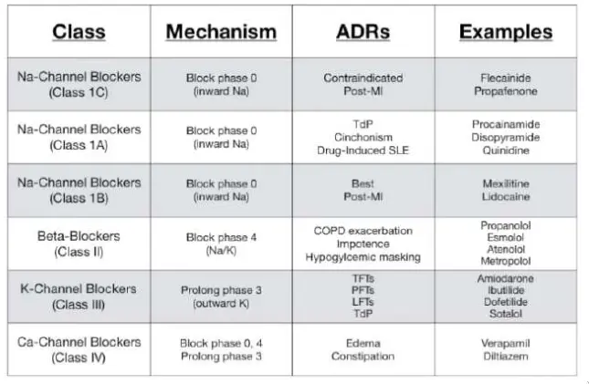
## [Gestational hypertension](https://en.wikipedia.org/wiki/Gestational_hypertension)
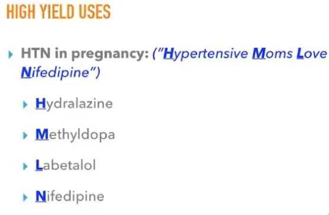
## Side Effects

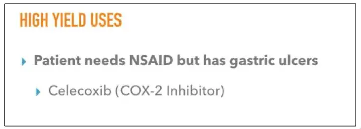
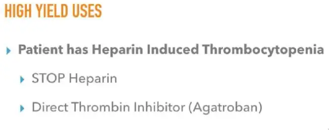
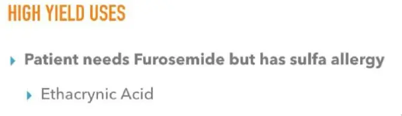
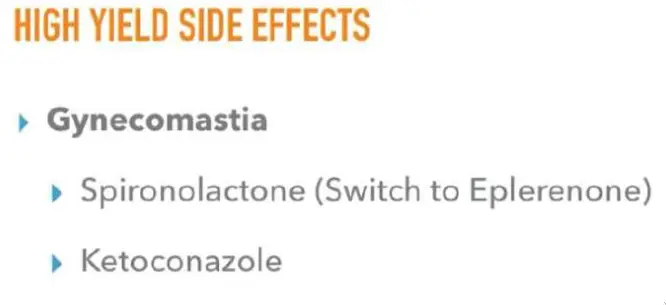
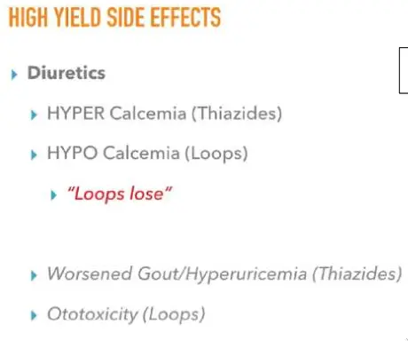

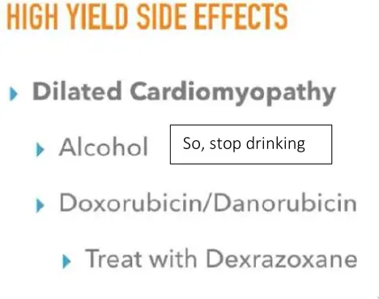
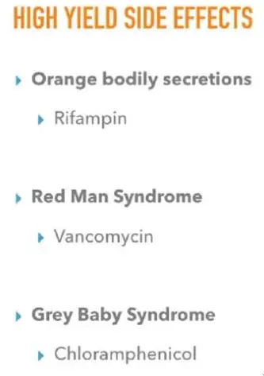

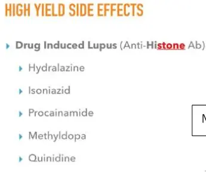
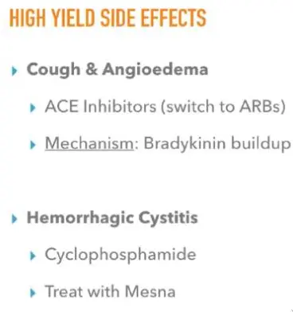
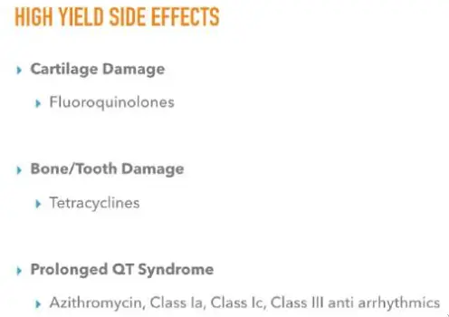
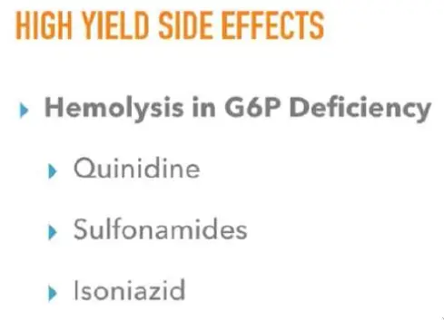
## [Tuberculosis management](https://en.wikipedia.org/wiki/Tuberculosis_management)
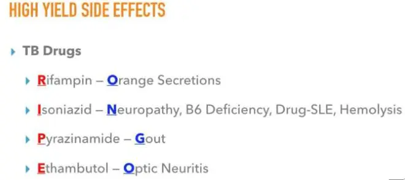
## [Alcoholism](https://en.wikipedia.org/wiki/Alcoholism)
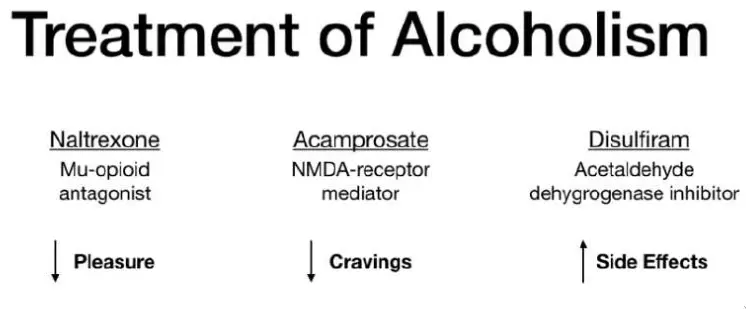
## [Monoclonal antibody](https://en.wikipedia.org/wiki/Monoclonal_antibody)
#### [List of therapeutic monoclonal antibodies](https://en.wikipedia.org/wiki/List_of_therapeutic_monoclonal_antibodies)
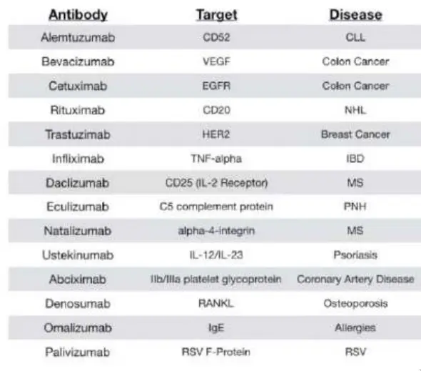
