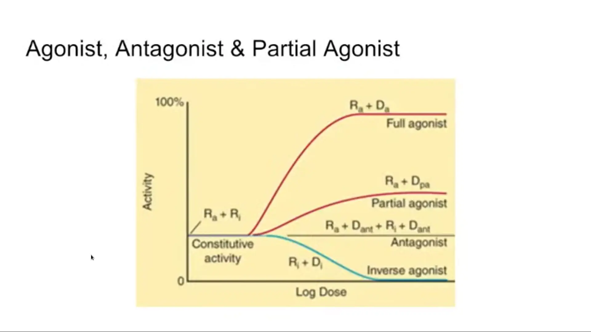
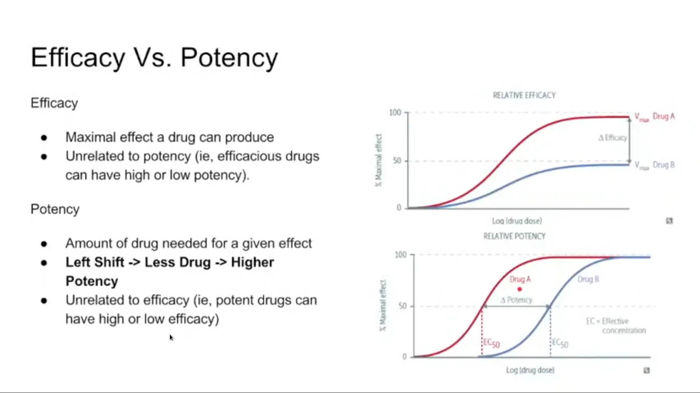
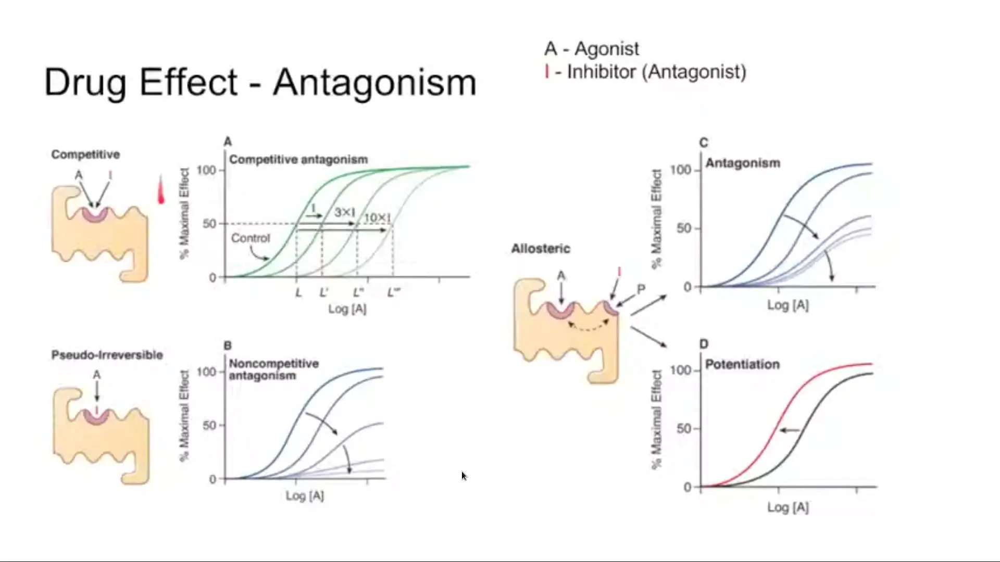
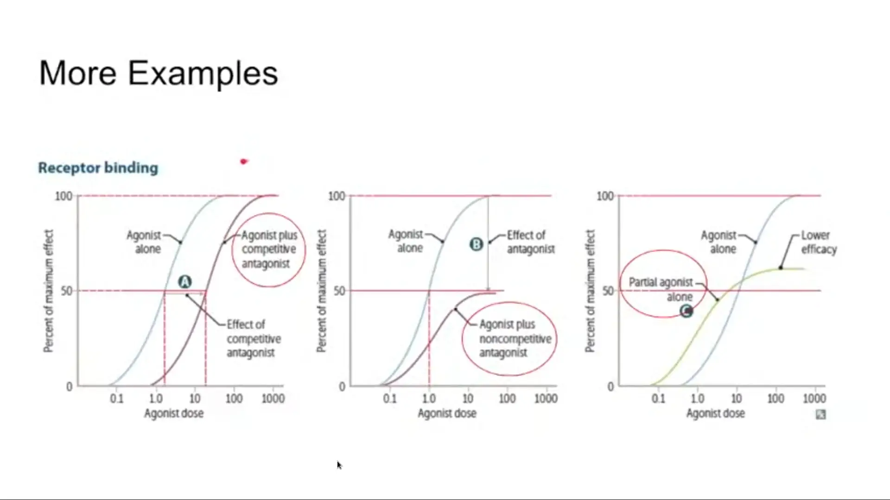
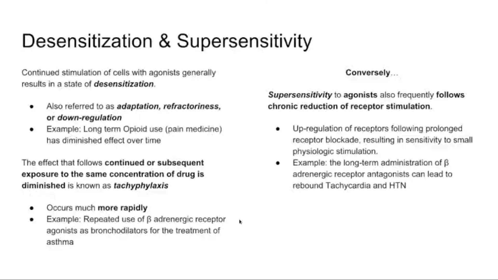
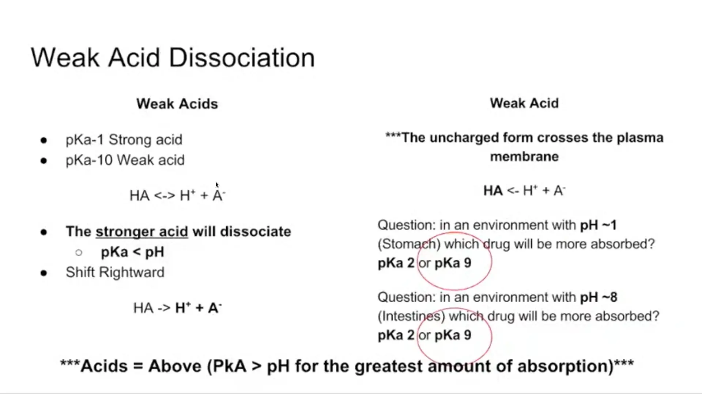
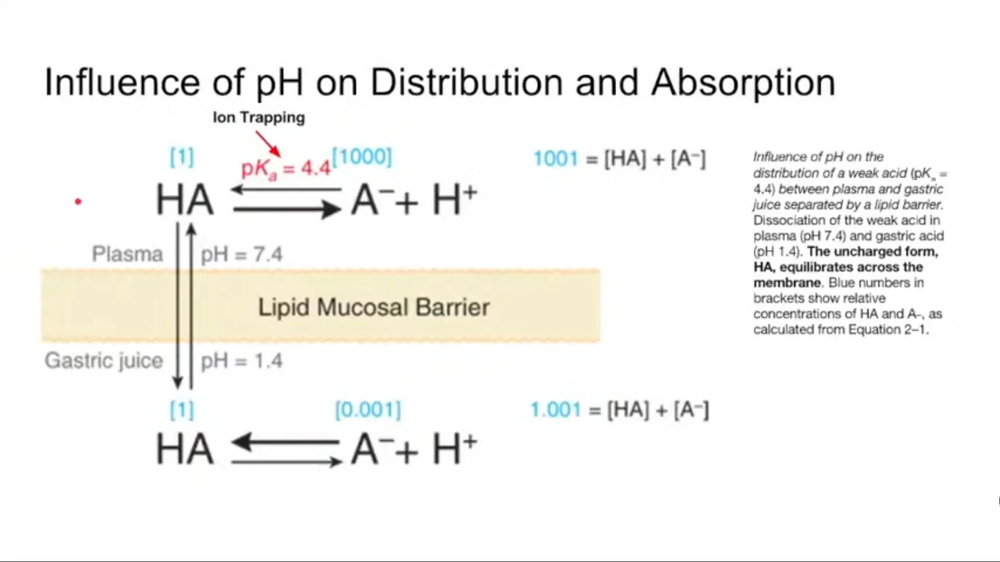
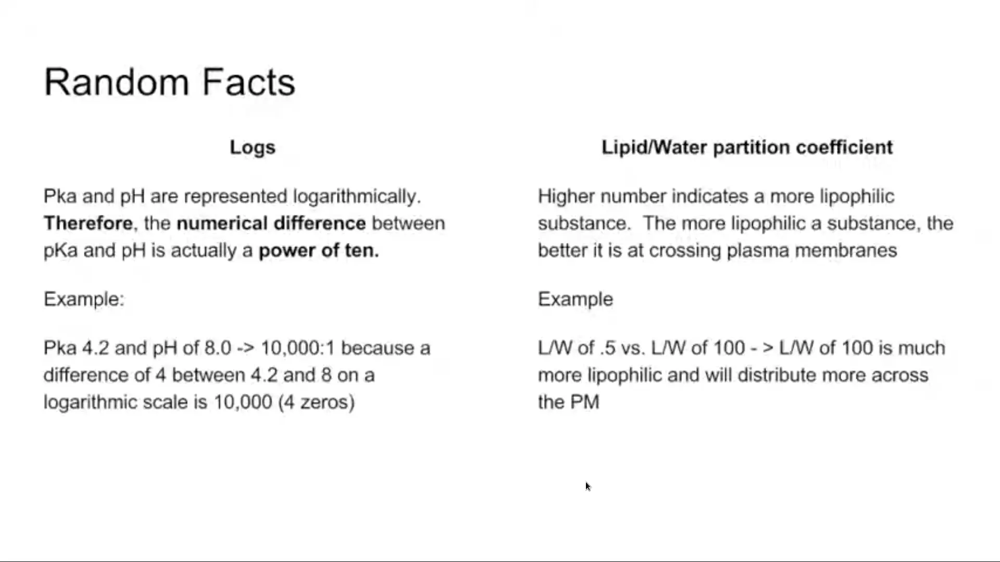

# [Pharmacodynamics](https://en.wikipedia.org/wiki/Pharmacodynamics) and Weak [Acids](https://en.wikipedia.org/wiki/Acid) and [Bases](https://en.wikipedia.org/wiki/Base_(chemistry))

## 

## 

## 

## 

## 

## 

## 

## 

